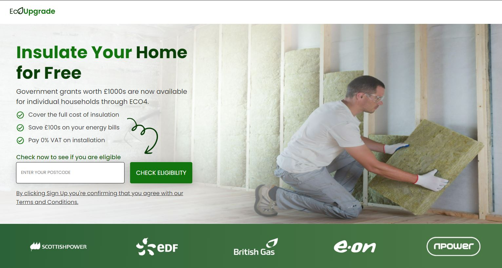

GitHub Copilot: # EcoUpgrade Website

## EcoUpgrade Homepage



### Table of Contents

-   [About The Project](#about-the-project)
-   [Technologies Used](#technologies-used)
-   [Getting Started](#getting-started)
    -   [Prerequisites](#prerequisites)
    -   [Installation](#installation)
-   [Features](#features)
-   [How to Use](#how-to-use)
-   [Contributing](#contributing)
-   [License](#license)
-   [Contact](#contact)

### About The Project

EcoUpgrade is a web application designed to provide information about government grants for home insulation. The application allows users to check their eligibility for grants, understand the benefits, and view frequently asked questions about the process.

### Technologies Used

-   HTML5
-   CSS3
-   JavaScript

### Getting Started

#### Prerequisites

-   A web browser (e.g., Google Chrome, Firefox)
-   Optional: A text editor for viewing or modifying the code (e.g., VSCode, Sublime Text)

#### Installation

1. Clone the repo
    ```
    git clone https://github.com/alexanderuk82/LandingPage.git
    ```
2. Open index.html in your web browser.

### Features

-   Check Eligibility: Allows users to input their postcode to check if they are eligible for the ECO4 grant.
-   ECO4 Explained: Provides a step-by-step guide on how the ECO4 grant works.
-   FAQs: A detailed FAQ section to answer common queries.

### How to Use

Navigate through the various sections using the menu at the top or by scrolling down the homepage. Use the 'Check Eligibility' feature to find out if you're eligible for the ECO4 grant.

### Contributing

Contributions are welcome! Follow these steps to contribute:

1. Fork the Project
2. Create your Feature Branch (`git checkout -b feature/AmazingFeature`)
3. Commit your Changes (`git commit -m 'Add some AmazingFeature'`)
4. Push to the Branch (`git push origin feature/AmazingFeature`)
5. Open a Pull Request

### License

Distributed under the MIT License. See LICENSE for more information.

### Contact

Your Name - your-email@example.com
